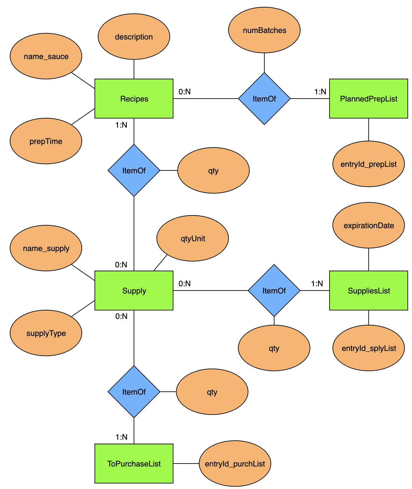

# Project Proposal
**Josh White** 
**3/30/2022** 
**CSPB 3287** 

My final project is going to be a Hot Sauce Recipe Book and supply management database which I can use to store all of my hot sauce recipes, as well as maintain a list of all current supplies and quickly build a shopping list based on what I have and what I need. The following sections describe the basis for my project, including the tools I will use to build and host the database, the envisioned database entities and their relationships, and some proposed use cases and design considerations for the project.

My goal with this project is to learn how a database can functionally be implemented using a high level API such as SQLAlchemy into a more integrated program such as a web app using Python code. With this goal in mind, I will demonstrate how a simple set of code modules can be developed to optimize a process that is meaningful to me, namely the storage of hot sauce recipes and management of the supplies used in their creation. 

## Database Layout / Relationships
Below is an E/R diagram which describes the layout of my project:

As the above diagram shows, the database will consist of five entities: Recipes, Supply, SuppliesList, PlannedPrepList and ToPurchaseList.

### Supply
The Supply entity is the lowest building block of the entire database. It defines all of the types of supplies that may be used in a hot sauce recipe and it can always grow, but will never shrink. Once a supply is added to this table, it will always be known. Each entry in this table will have a name, a unit that any quantity of that supply is to be reported in, and a type of supply (i.e. food, tool, etc.).

### Recipes
The Recipes entity is used to store entries that describe a hot sauce recipe in one line. It has a zero-many relationship with the Supply entity, meaning that either no recipe can include a given supply or any number of recipes can include that supply. The relation to Supply is as an ItemOf with a given quantity. An entity in this table will have the attributes of name, description and prep time.

### PlannedPrepList
The PlannedPrepList entity is used to track which sauces are planned for creation and how many batches of each sauce are planned. It has a zero-many relationship with Recipes that is described by the number of batches of that specific recipe. Each entry in this table has a unique entry ID.

### SuppliesList
The SuppliesList entity is used to track which supplies are currently owned that can be used toward creating a sauce. It has a zero-many relationship with Supply, the same as Recipes. It also has the attributes of a unique entry ID and an expiration date for the specific supply.

### ToPurchaseList
The ToPurchaseList entity is essentially a grocery list that contains all of the supplies that must be purchased in addition to what is in the SuppliesList in order to produce all of the recipes in the PlannedPrepList. It has a zero-many relationship with Supply like Recipes and SuppliesList do, as well as a unique entry ID attribute.

## Tools
The primary format for this project will be a Jupyter Notebook which can define all of the functions used for the project along with any explanatory text that may be necessary for explaining the project. The database will use the SQLAlchemy API to build Python functions which can be used for accessing the database to add and manipulate its contents. This will allow me to easily package most of the functionality of the project into simple commands for quick use or which could quickly be implemented in a web application. On the back end, I will use the course MySQL database as a simple test platform for verifying the proof of concept.

## Additional Database Design Considerations
### Queries
- **ShowRecipes**: Prints a list of every recipe in the Recipes table.
- **ShowPlannedRecipes**: Prints a list of every planned recipe in the PlannedPrepList table, with the number of batches planned for each recipe.
- **ShowCurrentSupplies**: Prints a list of all currently owned supply.
- **ShowExpiringSupplies**: Prints a list of all currently owned supplies that will expire within the next 7 days.
- **ShowGroceryList**: Prints a list of every supply on the ToPurchaseList, with the quantity to purchase of each supply shown.

### Triggers
- **Insufficient Supply Quantity**: When a recipe is added to the PlannedPrepList, the quantity of every supply in the added recipe is checked against what is currently in the SuppliesList. If the required quantity to make the recipe is not met, the difference between required and current is added to the ToPurchaseList.
- **Supply Item Not Known**: When a recipe is added to the Recipes table, if a supply is not currently in the Supply table then it is added as an entry to the Supply table.

### Common Database Manipulations
- **Update Recipe**: A recipe can be edited at any time to update the description or prep time, as well as the amount of any supply in the recipe.
- **Update Prep List**: An entry of the PlannedPrepList can be removed at any time in one of two ways: either the recipe was created or it was not. If the recipe was created then the supplies required to make the recipe are decremented in the SuppliesList.
- **Uodate Grocery List**: The grocery list can either be cleared entirely with one command, or entry-by-entry. In both scenarios, the command can declare that either the item(s) was purchased or it was simply removed. If it was purchased then the given supply is incremented in the SuppliesList.

### Sample Use Cases
- **Add Recipe**: Create a new recipe in the database by adding to the Recipes table. A recipe will initially be added with its name, description and prep time. Then, the system will prompt for supplies and their quantities to be entered one at a time. For each entered supply, if it does not already exist in the Supply table then an additional prompt will be displayed to provide the type of supply and unit of supply quantity. When all ingredients have been added, the recipe can be committed by entering an empty string supply name.
- **Create a Recipe Book**: Call the ShowRecipes query and pipe the output to a file to be printed and shared/referenced.
- **Update for Recipe Completion**: Log the completion of a recipe by removing the recipe's entry from the PlannedPrepList. Removal from this list updates the SuppliesList.
- **Update for Grocery Purchase**: Log the completion of a grocery shopping trip by clearing the ToPurchaseList. Clearing of this list will update the SuppliesList.
